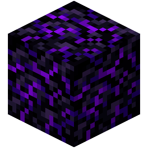

<div align="center">

# OBSIDIAN



### A Beautiful, Secure & Modern Web Browser

_Built with Electron for macOS, Windows & Linux_

[](https://www.electronjs.org/)
[](LICENSE)
[](#)

</div>

---

## ✨ Features

### 🎨 Stunning Design

- **Obsidian Theme** - Glassmorphic UI with purple gradients and crystal effects
- **Animated Backgrounds** - Pulsing glow effects and flickering grids
- **Native Feel** - Hidden title bar with macOS traffic light positioning
- **Custom Fonts** - Optional dot matrix retro font mode
- **Theme Variants** - Multiple color themes (Obsidian, Crimson, Ocean, Forest, Sunset)
- **Smooth Animations** - Polished transitions and loading indicators

### 🔒 Advanced Security

- **Sandboxed Webviews** - All web content isolated with `sandbox=yes`
- **Context Isolation** - Renderer processes fully isolated from Node.js
- **URL Sanitization** - Blocks `javascript:`, `data:`, `file://`, and other dangerous protocols
- **Trusted File Detection** - Only app pages (`newtab.html`, `settings.html`, `history.html`) can load locally
- **Permission Gating** - Secure-context checks for media/notifications (HTTPS or localhost only)
- **Download Protection** - Validates URLs before allowing downloads, blocks unsafe sources
- **Navigation Guards** - `will-navigate`, `will-redirect`, `will-attach-webview` hooks prevent malicious loads
- **CSP Headers** - Content Security Policy for local pages
- **Certificate Validation** - Rejects invalid SSL certificates
- **Ad & Tracker Blocking** - Built-in blocklist for common ad networks

### ⚡ Core Browsing

- **Multi-Tab Management** - Create, switch, and close tabs with keyboard shortcuts
- **Smart Address Bar** - Auto-completes, searches Google when no protocol detected
- **Bookmarks** - Save and organize favorite sites with favicon support
- **Full-Page History** - Time-grouped view (Today, Yesterday, This Week, Older) with search
- **Download Manager** - Progress tracking, save dialogs, and completion notifications
- **Security Indicators** - Lock icon shows HTTPS status
- **Loading Bar** - Visual feedback during page loads

### 🎛️ Settings & Customization

- **Theme Picker** - Choose from 5+ beautiful themes
- **Font Toggle** - Enable dot matrix font for retro aesthetic
- **Search Engine Selection** - Google, DuckDuckGo, Bing, Brave, Ecosia
- **Clear Data** - Wipe history, bookmarks, cache with one click

### 🖱️ Context Menu

- **Arc-Inspired Menu** - Right-click anywhere for quick actions
- **Navigation** - Back, Forward, Reload, Exit Full Screen
- **Content Actions** - Save As, Print, Translate to English
- **Developer Tools** - View Page Source, View Frame Source, Inspect Element
- **Frame Controls** - Reload individual frames

### ⌨️ Keyboard Shortcuts

| Shortcut       | Action            |
| -------------- | ----------------- |
| `Cmd/Ctrl + T` | New tab           |
| `Cmd/Ctrl + W` | Close tab         |
| `Cmd/Ctrl + R` | Refresh           |
| `Cmd/Ctrl + L` | Focus address bar |
| `Cmd/Ctrl + [` | Go back           |
| `Cmd/Ctrl + ]` | Go forward        |

---

## 🚀 Getting Started

### Prerequisites

- **Node.js** 16+ and npm
- **macOS**, Windows, or Linux

### Installation

1. **Clone the repository:**

```bash
git clone https://github.com/DevxD98/Obsidian.git
cd Browser-project
```

2. **Install dependencies:**

```bash
npm install
```

3. **Run the browser:**

```bash
npm start
```

### Development Mode

Run with developer tools open:

```bash
npm start -- --dev
```

---

## 🏗️ Building

Build for your current platform:

```bash
npm run build
```

Build for specific platforms:

```bash
npm run build:mac    # macOS (.dmg, .app)
npm run build:win    # Windows (.exe)
npm run build:all    # All platforms
```

Builds are output to the `dist/` directory.

---

## 📁 Project Structure

```
Browser-project/
├── assets/
│   ├── fonts/          # Dot matrix fonts
│   ├── icons/          # App icons (mac/win/png)
│   └── logo.png        # Browser logo
├── src/
│   ├── main.js         # Main Electron process (security, IPC, context menu)
│   ├── preload.js      # Secure bridge (contextBridge API)
│   └── ui/
│       ├── browser.js  # Tab management, navigation, security guards
│       ├── index.html  # Browser chrome UI
│       ├── newtab.html # New tab page with search & theme
│       ├── settings.html # Settings panel
│       ├── history.html  # Full-page history view
│       └── styles.css  # Global styles
├── package.json
└── README.md
```

---

## 🔐 Security Architecture

### Main Process (`main.js`)

- **Protocol Filtering**: Regex blocks `javascript:`, `data:`, `file:`, `about:`, `chrome:`, `smb:`, `ftp:`, `ssh:`, `tel:`, `mailto:`
- **Trusted File URLs**: Only allows `file://` paths under `src/ui/` (no directory traversal)
- **URL Sanitization**: `toSafeNavigationUrl()` and `toSafeDownloadUrl()` validate all user input
- **Webview Hardening**: `will-attach-webview` enforces `sandbox`, `contextIsolation`, `webSecurity`
- **Navigation Hooks**: `will-navigate` rejects untrusted protocols
- **Download Validation**: `will-download` checks source URL before allowing save

### Preload Script (`preload.js`)

- **Frozen API**: `Object.freeze()` prevents tampering
- **Minimal Exposure**: Only `navigate`, `getPageInfo`, `downloadFile`, download events, and `platform`
- **Unsubscribe Pattern**: Event listeners return cleanup functions

### Renderer (`browser.js`)

- **Navigation Guards**: `will-navigate`, `will-redirect`, `did-navigate` check URLs before allowing webview loads
- **Tab Isolation**: Each tab runs in a separate `partition` session
- **URL Validation**: `isSafeExternalUrl()` and `isTrustedLocalUrl()` whitelist trusted origins
- **History Filtering**: Only HTTPS/HTTP URLs stored (no local pages or blocked protocols)

### Content Security Policy

Local pages use strict CSP:

```
default-src 'self';
style-src 'self' 'unsafe-inline';
script-src 'self' 'unsafe-inline';
img-src 'self' data: https:;
font-src 'self' data:;
connect-src 'self' https:;
frame-ancestors 'self';
form-action 'self';
object-src 'none'
```

---

## 🎯 Roadmap

### ✅ Completed

- Multi-tab browsing with webview isolation
- Security hardening (sandboxing, URL validation, protocol blocking)
- Beautiful Obsidian-inspired UI
- Bookmarks and full-page history
- Settings panel with themes and customization
- Context menu with Arc-style actions
- Download manager with progress tracking
- Ad & tracker blocking

### 🔜 Coming Soon

- [ ] Extensions API support
- [ ] Private/Incognito mode with ephemeral sessions
- [ ] Password manager integration
- [ ] Sync across devices
- [ ] Advanced keyboard shortcuts
- [ ] Tab groups and workspaces
- [ ] Performance optimizations

### 🚀 Future

- [ ] AI-powered features (summarization, translation)
- [ ] Split-screen/side-by-side browsing
- [ ] Custom user scripts
- [ ] WebRTC controls
- [ ] Fingerprinting protection

---

## 🤝 Contributing

This is a personal project, but contributions, issues, and feature requests are welcome!

1. Fork the repository
2. Create your feature branch (`git checkout -b feature/AmazingFeature`)
3. Commit your changes (`git commit -m 'Add some AmazingFeature'`)
4. Push to the branch (`git push origin feature/AmazingFeature`)
5. Open a Pull Request

---

## 📄 License

MIT License - see [LICENSE](LICENSE) for details.

---

## 🙏 Acknowledgments

Built with:

- [Electron](https://www.electronjs.org/) - Cross-platform desktop framework
- Inspiration from Arc Browser's beautiful design
- Love for secure, privacy-respecting software ❤️

---

<div align="center">

**Made with 💜 by [DevxD98](https://github.com/DevxD98)**

_Obsidian Browser - Where security meets beauty_

</div>
